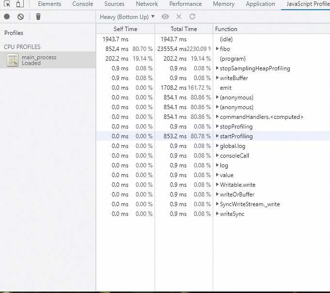
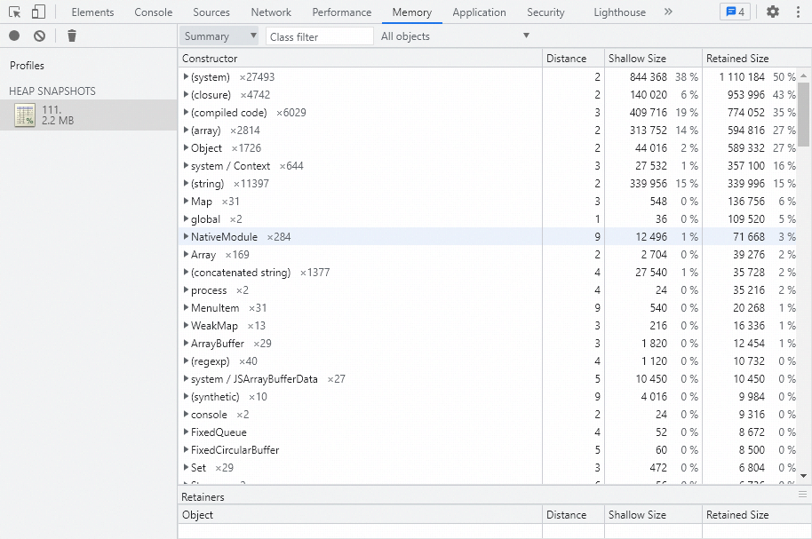

# Electron main process profiler

An Electron main process profiler.

# Build

npm install && npm run build

# Usage

## Sample code snippet

```js
const fs = require('fs');
const path = require('path');
const { app, ipcMain, BrowserWindow, dialog } = require('electron');
const profiler = require('../lib/electron-profiler');

const fibo = n => {
    if (n == 0) return 0;
    if (n == 1) return 1;
    return fibo(n - 2) + fibo(n - 1);
}

let profile;
const profile_name = 'main_process_profile';
const startCpuProfiling = () => {
    profiler.cpu.startProfiling(profile_name, true);
    fibo(40);
    console.log('finish fibo');
}

const stopCpuProfiling = async () => {
    profile = profiler.cpu.stopProfiling(profile_name);
    let outputPath = dialog.showSaveDialogSync({
        filters: [{
            name: 'Cpu Profile',
            extensions: ['.cpuprofile']
        }]
    });
    if (outputPath) fs.writeFileSync(outputPath, JSON.stringify(profile));

}

const takeHeapSnapshot = () => {
    let snapshot = profiler.heap.takeSnapshot('heap_snapshot', () => { });
    let outputPath = dialog.showSaveDialogSync({
        filters: [{
            name: 'Heap Snapshot',
            extensions: ['.heapsnapshot']
        }]
    });

    if (outputPath) {
        let chunks = [];
        snapshot.serialize(
            (chunk, len) => chunks.push(chunk),
            () => fs.writeFileSync(outputPath, chunks.join(''))
        );
    }
}

const main = () => {
    let win = new BrowserWindow({
        width: 800,
        height: 600,
        webPreferences: {
            preload: path.resolve(__dirname, 'preload.js')
        }
    });
    win.webContents.loadFile(path.resolve(__dirname, 'index.html'));
    win.show();

    ipcMain.on('start-cpu-profiling', () => startCpuProfiling());
    ipcMain.on('stop-cpu-profiling', () => stopCpuProfiling());
    ipcMain.on('take-heap-snapshot', () => takeHeapSnapshot());
}

app.whenReady().then(() => {
    main();
})
```

This code snippet show how to create and save **Cpu Profile** or **Heap Snapshot**.

## View cpu profile in DevTools

Open Chrome DevTools, `DevTools -> More Tools -> Javascript Profiler -> Load`, select saved cpu profile from disk. eg:



## View heap snapshot in DevTools

Open Chrome DevTools, `DevTools -> Memory -> Load`, select saved heap snapshot from disk. eg:



